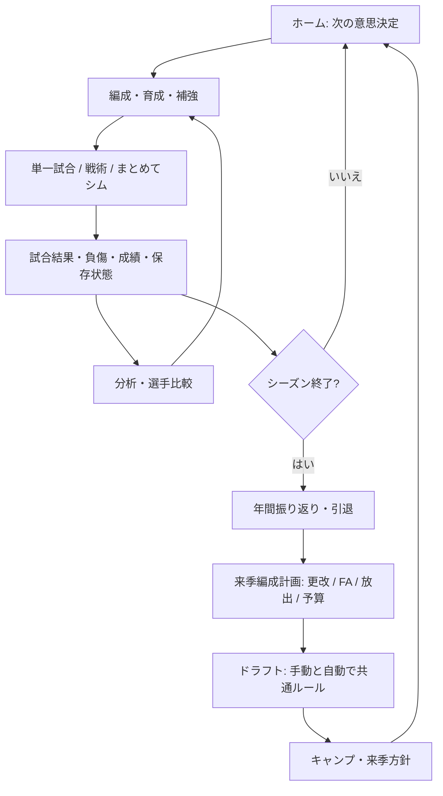
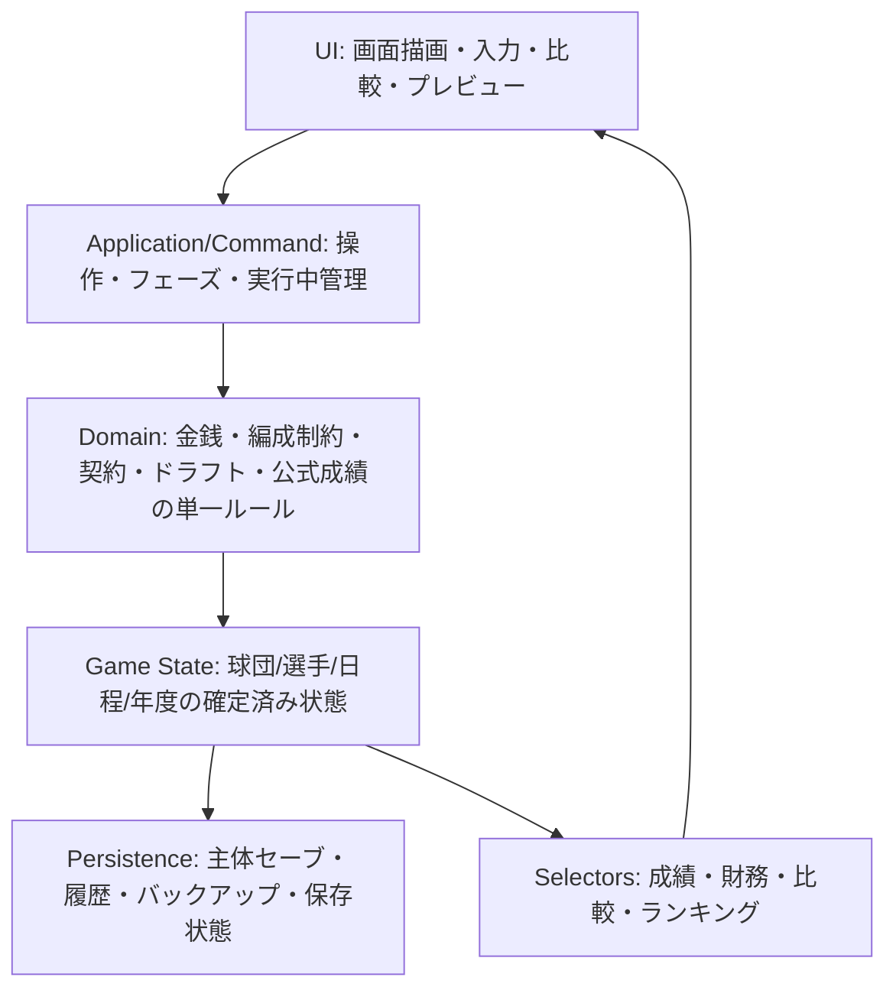
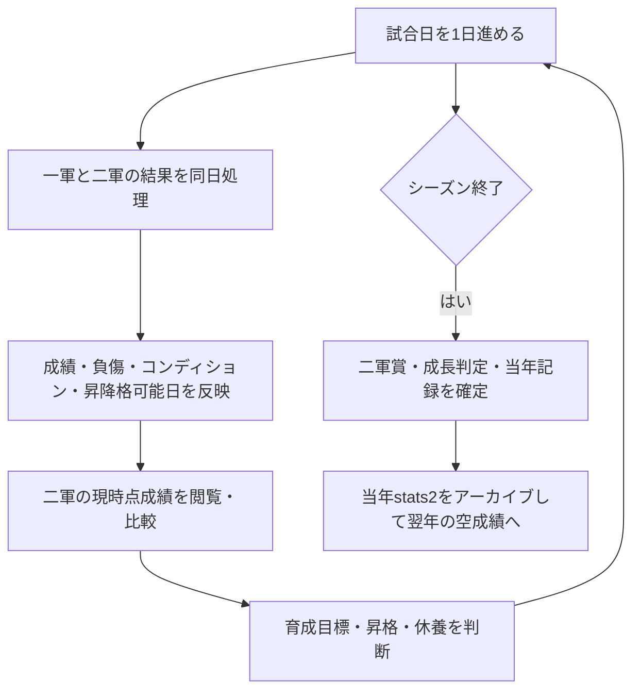

# Baseball Manager 全体改革の青写真 v1

- 作成日：2026-10-10
- 分析基準：`shotaro-hue/baseball-manager` main `86acb2ed7ea5ae95783b2847c0d1e356c11f54c7`（PR #431反映）
- 状態：**調査・企画成果物。実装未着手。**
- 範囲：UI/UX、機能統廃合、試合・編成・経営・分析・オフシーズン、保存・テストとの整合性
- ビジュアル方針：**スポーツ分析ハイブリッド**。Calm Dugoutは最終デザインとして採用しない。
- 注意：以下の問題候補はソース調査による。今回、新規の再現テスト・ブラウザ操作は行っていない。旧監査結果を未解決と断定せず、PR着手時に最新mainと照合する。

## DOC-01での最新mainとの照合（2026-10-10）

提供された青写真 v1をリポジトリ内へ収録し、以下の照合注記と課題台帳のBUG-S03／BUG-U01を更新した。分析基準と作業開始時のmainは同じ `86acb2ed7ea5ae95783b2847c0d1e356c11f54c7`。追加コミットとの差分はないが、青写真内の個別疑義は現行実装と照合する必要がある。

- **正本の区分：** 開発・検証の運用は [AGENTS.md](../AGENTS.md)、将来のUI/UX方針は [DESIGN_SYSTEM.md](./DESIGN_SYSTEM.md)、テスト実行は [TEST_STRATEGY.md](./TEST_STRATEGY.md)。本書は一次監査と改革ロードマップの参照元であり、具体的な配色・5タブ案・全画面構成・機能統廃合を承認済み仕様にしない。
- **BUG-S03は分けて扱う：** 財務画面の一軍＋二軍＋育成の年俸表示は、現行の [FinanceTab.jsx](../src/components/tabs/FinanceTab.jsx) → [contractPayroll.js](../src/engine/contractPayroll.js) と [既存仕様](./finance-contract-payroll.md) で対応済み。今回テストを再実行したという意味ではない。これを未解決として再登録しない。一方、[analysisComparison.js](../src/engine/analysisComparison.js) はERAの `|| null` と一軍のみの `payroll` 集計が残るため、球団比較側だけを静的疑義として保持する。
- **BUG-U01：** DOC-01で両ガイドの将来方針を整合させる。PRがmainへ反映されるまではmain上で解消済みとは扱わず、UI移行の完了とも扱わない。
- **その他の課題：** 一次監査の調査候補を保持する。本PRは個別課題の再現・障害等級確定・全件の再監査ではない。後続FIXの着手時に関連PR・現行コード・既存テストと照合し、「既対応／疑義継続／要再調査」を記録してから最小再現へ進む。新しい課題や修正完了を推測で登録しない。
- **文書整備の検証範囲：** 参照先・方針・Markdown差分のみ。ブラウザ表示・実機操作・保存挙動の新規検証は行っていない。既存UIと旧CSS、ゲーム処理、保存形式、CIと段階的テスト戦略は維持する。

## 1. 目的と成功定義

ゲームの基本循環「状態把握 → 根拠を見る → 判断・操作 → 結果反映 → 振り返り」をスマホ上で一貫させる。

達成条件：
1. 編成・補強・育成などの選択には、費用・制約・効果の説明がある。
2. 手動・自動・通常試合・戦術・まとめて進行で、ゲームルールと記録・保存の意味が揃う。
3. 同じ成績は画面をまたいで同じ値・母集団・期間・単位を持つ。欠測・算出不能と実測0を分ける。
4. 実操作における「戻る」「比較する」「対象選手を保持する」「保存失敗から復旧する」を保証する。
5. Nシーズン継続・中断・ロード・移籍・引退で選手と履歴が消失・重複しない。
6. 以前のCalm Dugout配色・旧コンポーネントを新規画面の基準としない。既存の動作品は新部品への置換時まで維持する。

## 2. 年間プレイ体験の目標

### 操作の原則

- **プレイヤーが判断する工程は残す**。不要な中間選択・確認・ページ遷移は統合する。
- **どの段階でも閲覧・分析は可能**にする。編成不備があっても、試合開始のみブロックする。
- 不可逆な行為（契約、放出、ドラフト確定、年度移行）はプレビュー、影響、取消可否を明示する。
- ゲーム進行中には保存状態（保存中・保存済み・失敗）を常時見つけられるようにする。
- 自動化は入力・選択の自動化であり、ロジック・確率・登録人数等の制約を迂回してはならない。

## 3. 情報設計：スマホの5タブ（案）

| 常設タブ | 最も重要な役割 | 下位コンテンツ |
| --- | --- | --- |
| **ホーム** | 現在地と「今、何をするか」 | 次戦、経営・選手アラート、前回結果、保存状態、通知 |
| **編成** | 選手の起用・育成を変更 | ロスター、DH別打順、先発・継投、昇降格、育成目標、コーチ効果 |
| **日程** | 試合進行と結果閲覧 | 次の試合、1試合通常／戦術、まとめてシム、試合履歴、ボックススコア |
| **分析** | 根拠ある比較と記録 | 自球団成績、リーグ成績、選手比較、打球分析、順位、通算・表彰 |
| **経営** | 契約・補強・資金配分 | 予算・給与・収入、FA・トレード、スカウト、契約、球場投資、スタッフ |

**共通領域（5タブの内側に埋めない）：** 通知・メール、重要な処理状態、設定／データ操作、バランス検証などの開発・詳細機能。

オフシーズン中は上記の5タブを消さず、**年間フェーズ帯（振り返り→編成計画→ドラフト→開幕）**を表示する。閲覧画面から誤って不可逆な工程を進めないよう、フェーズ進行を専用導線に限定する。

既存内部の `tab` ID、保存ID、画面ルーターは、初期段階で全面置換しない。新しい見せ方と既存処理をアダプタでつなぐ。

## 4. プロダクト機能の処遇

| 領域 | 維持 | 修正・設計変更 |
| --- | --- | --- |
| 試合・編成 | DH別設定、戦術、まとめてシム、編成自動化 | 画面移動制限、手動/自動ルールの明示、結果から再編成導線 |
| オフシーズン | 編成計画、契約交渉、一括提示、FA市場、保存再開 | 確定／予定の区別、ドラフト手動/自動の等価性、残枠と補強見込み |
| 経営・補強 | 人気、オーナー信頼、コーチ、球場、スカウト、CPUの補強方針 | 金銭取引、期間処理、ROI、翌年負担、取引の共通検証 |
| 成績・育成 | 詳細指標、比較、打球イベント、年度別・通算、育成目標、成長エンジン | 二軍シーズン更新、年度リセット、集計母集団、精度・ゼロ表記 |
| 保存・履歴 | IndexedDB、世代管理、年度別履歴の遅延読込 | 画面ごとの保存状態可視化と失敗時復旧導線 |
| 旧UI/CSS | 移行するまで動作維持 | 新UIでCalm Dugoutの再採用を禁止。置換後に旧CSSを整理 |

**統合・廃止候補（まだ確定しない）：** 「残留予定／交渉予定」の重複意味、通常ナビ下のバランス検証、重複する結果確認、旧オフシーズン分岐。旧セーブの互換性を調査してから決定する。

## 5. 発見した課題台帳（一次監査）

| ID | 優先 | 事象 | 主な該当箇所 | 検証状況 |
| --- | --- | --- | --- | --- |
| BUG-T01 | P0 | トレード金銭のUI単位「万円」を `handleTrade` が再度×10000 | `TradeTab.jsx`, `useOffseason.js` | 静的コード確認、実行再現待ち |
| BUG-T02 | P0 | 逆提案でCPU側の追加選手がプレイヤーの受取側へ入り得る | `TradeTab.jsx` | 静的コード確認、実行再現待ち |
| BUG-T03 | P0 | 手動トレードはCPU間トレードと違い、確定直前のロスター／予算／所属検証を十分経由しない | `useOffseason.js`, `cpuTradeExecution.js` | 静的コード確認 |
| BUG-D01 | P0/P1 | ドラフト全自動が登録枠、競合抽選、入団拒否の手動処理を迂回する | `Draft.jsx`, `useOffseason.js` | 静的コード確認、シナリオ再現待ち |
| BUG-F01 | P1 | 二軍143試合をシーズン末にまとめて生成。シーズン途中の育成判断に反映されない | `simulation.js`, `useSeasonFlow.js` | 静的コード確認 |
| BUG-F02 | P1 | 二軍 `stats2` が翌年更新時にリセットされず、当年値と混在する可能性 | `simulation.js`, `useOffseason.js` | 静的コード確認 |
| BUG-F03 | P1 | 二軍成績はAB未生成、打率画面ではH/PA、表彰はH/ABのため整合しない | `simulation.js`, `RosterTab.jsx`, `awards.js` | 静的コード確認 |
| BUG-S01 | P1 | 一軍で出場後に二軍に下がった選手がシーズンランキングから消える | `StatsTab.jsx`, `LeaderboardTab.jsx` | 静的コード確認 |
| BUG-S02 | P1 | `saberBatter` のOPSが小数第2位に丸められ、表示と順位の精度を失う | `sabermetrics.js` | 静的コード確認 |
| BUG-S03 | P1 | 球団比較でERA 0.00を欠損扱い、比較用総年俸に二軍が含まれない | `analysisComparison.js` | 静的疑義継続。財務画面の二軍年俸表示は既対応（上記照合注記） |
| BUG-R01 | P1 | 画面によって勝敗投手の表示判定が異なる | `ResultScreen.jsx`, `postGame.js` | 静的コード確認 |
| BUG-V01 | P1 | まとめシム結果表示時と非同期保存完了を識別しにくい | `useSeasonFlow.js`, 結果画面 | 静的コード確認 |
| BUG-SC01 | P1 | スカウトのweeks定義に対し3秒タイマー、リロード時の進行持続性が不十分 | `useGameState.js`, `HubScoutTab.jsx` | 静的コード確認 |
| BUG-SC02 | P1 | 投手/野手の乱数とポジション選択の乱数が独立 | `useGameState.js` | 静的コード確認 |
| BUG-M01 | P1 | 球場投資初回 `5,000,000万円` に対して初期予算は約35～65億円 | `FinanceTab.jsx`, `constants.js` | 静的コード確認、経済シミュ検証待ち |
| BUG-M02 | P1 | 収入は両チームの各出場試合に計上する一方、財務の年間予測はホーム試合数基準 | `regularGameUpdates.js`, `FinanceTab.jsx` | 静的コード確認 |
| BUG-N01 | P2 | 編成不備が別画面への移動まで禁止 | `HubShell.jsx` | 静的コード確認 |
| BUG-U01 | P2 | 両ガイドの将来デザイン方針の整合 | `AGENTS.md`, `docs/DESIGN_SYSTEM.md` | DOC-01の文書差分で対応。main反映待ち、UI移行は未着手 |

重要：P0/P1は改修優先候補であり、実行確認済みの障害等級とは限らない。既存PRの修正と重なる場合は現行mainを優先する。

## 6. 共通処理の設計原則

### 6.1 各レイヤーの責務

**共通不変条件：**
- 金額は内部「万円」に統一し、UI入力／外部連携境界でのみ明示的に単位変換する。
- 契約・補強・トレード・ドラフトは、UIではなく共通Domain関数で登録人数、所属ID、予算、費用、対象年を再検証する。
- 手動と自動は**選択手段だけ**が異なり、共通の応募・抽選・入団判定・契約ルールを用いる。
- 成績は実測0・未記録・算出不可・対象外を分け、丸めは表示時に限定する。
- 野手・投手・ファーム・レギュラー・ポストシーズンの記録は別の対象として保持する。
- 途中ロードでは交渉、乱数判定、CPU獲得、ドラフト、年度更新を二重実行しない。
- 保存失敗を成功と表示しない。セーブ世代・詳細履歴・打球アーカイブの保存状態を区別する。
- UI変更だけのPRでドメインロジック、既存セーブスキーマ、確率定数を黙って変更しない。

### 6.2 二軍シーズンの理想案

二軍は軽量な統計モデルでよい。143試合を実時間で一括生成せず、ゲーム内進行日との対応、昇降格時の継続統計、年次リセットを優先する。

## 7. スポーツ分析ハイブリッド：デザインシステムv2

### UXルール
1. **情報の階層：** まず結論・現在地・主操作。判断根拠は同画面の近くに。詳細は表・展開・選手詳細へ。
2. **密度：** 大きいカードを並べるのではなく、整列した数値行、表、要点だけを強調するパネル。不要な装飾・絵文字・過剰な影を避ける。
3. **ビジュアル：** 放送系スポーツデータの緊張感と、業務分析ツールの可読性。強いチームカラーは識別に限定し、状態意味に使わない。
4. **レスポンシブ：** 360/390pxで主操作を確保。表は独立スクロール、選手名固定。768px付近や1024px前後の境界、PCの一覧密度も検証。
5. **数値：** 桁・単位・分母・期間・出場条件・集計元を明示。ランキングの欠測値は末尾、0と混在させない。
6. **操作：** 44px以上のタップ領域、キーボード・音声読み上げの意味論、明確な戻る動線、危険操作の影響・確定を分離。
7. **状態：** 進行中／完了／失敗／保存待ち／変更未確定／情報未記録を各画面で明示。

### 代表画面・モックの順序
- **A ホーム＋試合結果：** 「編成→試合→結果→見直し」の基本循環。
- **B オフシーズン編成計画＋交渉：** 可逆な方針、不可逆な取引、予算・登録人数・未解決契約の関係。
- **C 選手分析・ランキング：** 0と欠測、母集団、年度、2人比較、育成・編成への遷移。

A/B/Cの画面構造と部品を承認してから、トークン・コンポーネントを固め、後続の画面へ展開する。各小修正で新規モックを作る必要はない。

## 8. 推奨PR分割と依存関係

| PR群 | スコープ（1PR 1責務） | 必須成果 |
| --- | --- | --- |
| **DOC-01** | v2青写真とWork指示をリポジトリに置く | 新方針、旧Calmを規範としない注記、進め方、関連資料の正本指定 |
| **FIX-T** | トレード取引の単位・逆提案・共通検証 | 金額・枠・二重実行のRED→GREEN回帰 |
| **FIX-D** | ドラフト手動/全自動処理の共通化 | 抽選・拒否・登録枠・保存再開の同等性 |
| **FIX-F** | 二軍成績の更新時期・AB・年度リセット | シーズン中の成績、昇降格、二軍タイトル、複数年整合性 |
| **FIX-S** | 公式成績selectorとランキングの母集団・精度 | 同一選手の数値、実測0、二軍所属の一軍出場者、賞との整合性 |
| **FIX-V/M** | 保存状態表示と財務ルール（詳細は別PR） | 保存再試行、年俸・支払済み・年間予測の説明、経済バランス計測 |
| **DES-01** | 画面モック＋正式デザインシステムv2 | 代表3画面、色・書体・余白・表・ナビ・状態・アクセシビリティ |
| **UI-01** | 共通シェル＋ホーム・試合・結果の縦断体験 | 5タブ、次の一手、保存状態、結果から編成 |
| **UI-02** | 編成・成績・選手詳細・比較 | 複数画面で整合する数字と対象コンテキスト |
| **UI-03** | 契約更改・FA・ドラフト・経営 | フェーズ案内、決定と予定の区別、予算・補強の導線 |
| **QA-01** | 全画面の移行確認・旧CSS整理・総合QA | 多シーズン/復旧/ブラウザの証跡を伴う完了判定 |

各「PR群」はそのまま一つの巨大PRにする指示ではない。FIX-VとMやUI-03の経営・ドラフトは、リスクと変更量により独立PRへ分割する。

**依存関係：**
- DOC-01はUI実装より先。
- FIX-T/D/F/Sは該当画面改修の前（または、同じ機能のUI着手前）に完了。
- DES-01の仕様・部品だけを先行し、ゲームの全ロジック修正を待ってUI準備を止めない。
- 代表画面が検証できてから、全画面CSS移行を広げる。

## 9. 品質ゲートとテストコスト

既存`docs/TEST_STRATEGY.md`とPR #431の仕組みを維持する。

- 調査：全テスト実行不要。変更予定領域と実装経路、旧テストの対象を特定。
- バグ修正：最小再現ケースを先にRED→修正後GREEN。近傍テストだけローカル実行。
- 実装PR：ビルド・通常Vitest・CIの対象E2Eを、GitHub CIの同一SHAで確認。Work側で全セットを重複実行しない。
- 画面/保存に影響するPR：該当するPlaywrightだけ必要に応じてローカル実行。
- リリースや大規模な画面移行：手動「Extended Browser E2E」を一度実行し、結果を記録。
- 保存・年次遷移は、途中失敗、再試行、リロード、複数年、ID=0、二重実行、データ欠測を含む。
- スマホ：360px / 390px。PC：1440px。760/761、1023/1024等の対象ブレークポイント境界もチェック。
- 不具合未再現／ブラウザ未検証／CI実行中を「合格」と表現しない。

## 10. Workへの最初の依頼（DOC-01）

> `shotaro-hue/baseball-manager`の最新mainを確認し、以下の設計・開発ガイドラインを整備する独立PRを作成してください。自動マージしない。
>
> 目的：現行の`AGENTS.md`と`docs/DESIGN_SYSTEM.md`がCalm Dugoutを将来のUI基準としてしまう問題を解消する。今後のデザイン方向を「スポーツ分析ハイブリッド」に変更し、機能・処理・UXの監査結果を参照可能にする。
>
> 必須：
> - 現行の保存・テスト・画面ロジックを改変しない。**文書のみのPR**。
> - 新方針：スマホ中心、データ可読性、判断→実行→振り返り、UIとDomainの責務分離、実測0と欠測の区別。
> - 既存Calm系CSSは移行完了まで維持するが、新規画面のデザイン基準として再利用しない。
> - 旧資料は履歴として残し、現在の指示と間違えないよう明記。
> - 5タブ案と3代表画面は提案段階であり、画面実装・ナビ変更は今回行わない。
> - 全体の課題台帳は一次監査の疑義として記載し、再現未確認項目を修正完了・バグ確定と書かない。
> - `docs/TEST_STRATEGY.md`の段階テスト、CI再利用を維持。全テストをWorkが繰り返さない。
> - ブラウザ表示・実機操作・保存挙動をテストしていない旨を報告。
>
> 成果：新しい正本のデザイン方針文書、AGENTSからの参照、旧資料への履歴ラベル、変更差分とPR URL。

**注意：** 本青写真は2026-10-10のmainを基準とする。実装開始時点のmainで既修正項目を再判定し、修正済みの内容を再実装しない。
