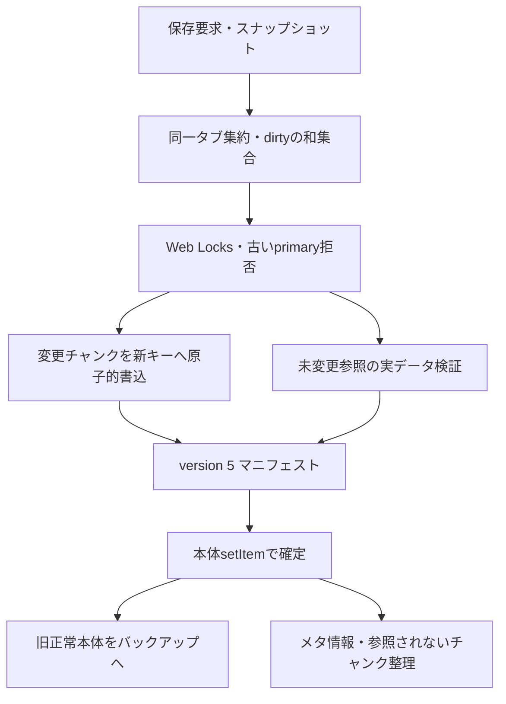

# F3-A 保存整合性

Base: main 9efaf56a581d7fd2a79ae5f777516dc05ac21a62, 2026-10-09.

## 再現結果
修正前の実コードへlocalStorage書込エラー、IndexedDB transaction abortを注入。11テスト中10件失敗: 旧本体に新しいニュースが混入、バックアップ履歴混在、メタ失敗で保存失敗扱い、primary消失時hasSave=false、新ゲームへの固定キー継承、容量不足時バックアップ削除、キューの可変payload／dirty欠落。abortテストは旧putと新addの両方を対象にして同じ保存境界を操作する。

## 方式比較
| 方式 | 判定 | 理由 |
|---|---|---|
| 不変チャンク＋本体マニフェスト | 採用 | dirty部分保存を維持し、旧世代を変更せず本体のsetItemを確定境界にできる |
| 本体・全履歴を単一IDBレコードに毎回複製 | 次点 | 一括原子性は簡単だが通常保存の全履歴複製と既存localStorageロードの変更が必要 |

チャンクキーはsaveId＋独立generation＋scope。行と参照の保存ID／世代／形式／scope／長さとチェックサムを検証。変更チャンクは単一IDB transaction、既存参照への上書きなし。バックアップローテーションは新本体確定後。メタ／整理／バックアップ更新失敗はwarningsで、本体保存成功と区別する。

読み込みは候補ごとにそのマニフェストを検証し、4履歴が揃った候補のみ採用。不足を空配列に置換しない。primaryが消失しても「続きから」を表示し、復旧元を通知する。全候補無効は復旧不能と通知する。

## 旧形式
version 4以前の読取を維持。初回保存はdirtyに関係なく4チャンクを書き出す。移行失敗で旧本体／固定キーを変更しない。旧バックアップが残る間、固定キーを削除しない。不明・破損したrootがある場合は保守的に整理を中止する。既に混在した旧固定キー履歴は完全復元を保証しない。

## 別タブ
Web Locksで本体確定・整理までorigin単位で直列化。読み込み開始時のprimary文字列を保存し、別タブ更新後の古い状態の保存を拒否する。Web Locksがないブラウザは安全な保存不可を通知する。ブラウザ削除やAPI外からの直接改変まで制御しない。

## 独立レビュー
4件の重要指摘を実コードで再現後、RED→GREENで修正:
1. 非同期ロード中の別タブ保存を誤って採用して古い状態を上書き。
2. primaryチャンク欠損後のバックアップ復旧データを再保存できない。
3. ローテーション期限到来＋本体quota失敗時にbackup2が置換される。
4. セーブ削除後、新ゲーム保存が自己競合で拒否される。

再レビューで進行中保存と公式削除の競合も再現。削除を同じWeb Lock／localSaveTailで直列化し、enqueue時の削除epochで削除前の待機保存を失効。TitleScreenは削除完了を待ち、操作抑止と失敗通知を行う。primary消失中のバックアップ復旧も別タブ削除を検出する。独立再レビューで解消を確認。

## F3-Bとの境界・未解決
career_logsはplayerId固定キーのまま。年度更新／引退の先行書込と、新規ゲームの初期履歴置換、旧ロードの移行副作用はF3-Aでは修正しない。本体4履歴が整合しても、career_logsまで同世代とは保証しない。

打球アーカイブはsaveId分離済みだが独立確定。試合本体成功＋アーカイブ失敗は通知で区別し再試行する。古い本体復旧時に未来試合のアーカイブが見える可能性、再試行待ちのページ終了後喪失は未解決。

F3-B最有力はマニフェストへsaveId別通算履歴参照を追加し、年度更新／引退は確定待ちpayloadを本体と同時に確定する方式。旧career固定キーの所有ゲーム識別情報が存在しないため、ゲーム切替をまたいだ旧データの完全な帰属判定は不能。単純なキー変更や本体保存後へ順序逆転するだけではバックアップ復旧と年度境界の整合は保証できない。

## 検証・性能
最終結果はこの節に記録する。性能fixtureは同じ新規ゲームfixtureを試合数・5年履歴へ決定的に拡張したデータ。5年分の実プレイ進行を計測したものではない。容量はチャンクのJSON UTF-8論理バイトと圧縮localStorage UTF-16バイト、ブラウザestimateは可能な場合に併記する（実ディスク割当の保証値ではない）。

### 先行版性能比較（Chromium、各10回）
同一fixture・ブラウザで変更前と最終版を比較。数値は保存/読込の中央値と最遅値（ms）。初回やホスト負荷による変動を含み、単一値の速度保証ではない。Mobile WebKitは保存・復旧E2Eで検証し、性能値はChromiumで比較した。

| ケース | 保存 前 中央/最遅 | 保存 後 中央/最遅 | 読込 前 中央/最遅 | 読込 後 中央/最遅 |
|---|---:|---:|---:|---:|
| 初回 | 658.5 / 915.0 | 949.6 / 1174.5 | 118.8 / 156.2 | 111.2 / 157.0 |
| 通常試合後 | 764.6 / 1561.7 | 925.1 / 1165.6 | 107.2 / 198.1 | 86.4 / 299.8 |
| 5試合後 | 771.8 / 1202.5 | 756.7 / 1015.4 | 105.3 / 234.6 | 80.3 / 144.3 |
| オフシーズン | 755.5 / 1738.7 | 867.0 / 1187.2 | 98.4 / 293.5 | 89.2 / 123.2 |
| 5年相当（合成履歴） | 714.1 / 1086.2 | 929.7 / 1242.1 | 135.1 / 170.5 | 90.1 / 185.3 |
| バックアップ復旧 | 714.1 / 1282.0 | 989.5 / 1413.8 | 120.7 / 242.5 | 106.2 / 140.5 |

| ケース | IDBチャンク論理B 前→後 | 圧縮本体＋バックアップB 前→後 |
|---|---:|---:|
| 初回 | 384 → 820 | 341,568 → 342,216 |
| 通常試合後 | 506 → 1,579 | 683,136 → 684,468 |
| 5試合後 | 998 → 2,563 | 683,136 → 684,468 |
| オフシーズン | 18,328 → 37,527 | 683,224 → 684,530 |
| 5年相当（合成履歴） | 110,876 → 333,934 | 1,024,706 → 1,026,676 |
| バックアップ復旧 | 384 → 2,458 | 683,150 → 684,452 |

5年相当は3世代保持の上限寄りのfixtureで、チャンク論理サイズは約111KB→334KB。本体＋backupは約1.025MB→1.027MB。未変更チャンクは参照再利用するため、毎回全データが3倍になる訳ではない。storage.estimateの値は非同期・実装依存のため容量保証には使わず、原データをJSONに併記した。

保存遅延の改善: キューで所有したsnapshotを再コピーしない。前回の本体文字列と検証済みメモリrootが一致する場合は再展開しない。変更チャンクの旧行を読む必要はなく、再利用する参照だけを検証する。GCはkey cursorで列挙し、履歴の値を複製せず不要キーだけを削除する。

追加障害: 失敗した進行中保存のdirtyScopesを待機要求へ継承し、後続の部分保存で変更を取りこぼさない。全変更チャンクの再書込では、欠損した旧行を継承せず修復可能にする。破損primaryからの復旧時、検証済みbackupのメモリrootをprimaryと誤認してローテーションしない。

### 品質ゲート
- npm ci: 成功。
- npm test: 最終版681成功、既存skip 2件（追加skipなし）。物理演算HRおよび保存連携のテストを含む。
- npm run build: 成功（既存のchunk size警告あり）。
- npm run test:e2e:smoke -- --workers=1 --retries=0: 最新版19/21成功、低速CPU初期化・旧inlineポスティング承認の2件が30秒test timeout。先行版は21/21成功。最新版の失敗を先行結果で置き換えない。
- 全E2E・GitHub CIの最終結果はPR本文に記録する。最初の最終版全E2Eは28/55成功時点で追加レビューの削除競合修正が必要となり停止。未完走で合格扱いにせず、修正後の最終版を再実行する。
- 独立レビュー5件をRED→GREENで修正。追加のキュー失敗時dirty継承・復旧後の再保存・旧チャンク修復の回帰テストも成功。
- 開発中の別試行は、npm ciとの同時起動、実装中HMRによる別モジュールの保存キュー参照、並列負荷下のtimeoutがあり未完走として停止。これらを合格判定に使わず、最終コードで直列・retry 0の受入実行を行った。

残存制約: キャリア／打球アーカイブはF3-Bの境界。旧ビルド・API外からの直接ストレージ改変はWeb Locksを尊重しない。既に混在・破損した旧固定キーの完全復元は保証しない。性能の5年fixtureは合成履歴であり、実プレイ5年分の負荷上限を保証しない。

最新版では通常試合後の保存中央値+161ms（約21%）、5年相当+216ms（約30%）、初回+291ms（約44%）。snapshotの独立コピー、再利用参照検証、旧世代保護と整理の追加コストを含む。既存処理の圧縮と同じ大きなゲーム本体を使い、dirtyチャンクだけを複製する。チャンクの分割や状態snapshot構築の軽量化は改善余地だが、整合性検証の省略は行わない。測定にはホスト負荷変動があり、時間増加を成功条件7の判断材料として明示する。

### 最新CIの未解決ゲート（dbd76b4）
- build/unit/physics成功、保存障害suite 10/10成功（両ブラウザ、削除競合を含む）。
- initialization/progressionは7/8成功、E4の健康選手保持assertionで失敗。
- history/postingはブラウザ依存パッケージインストール中に10分job上限でcancelled。テスト未実行。
- E4の同じ差分を保存・Worker・試合を介さず既存mainの緊急編成関数で再現。seed1初期team4、遊撃10日負傷の処理後、一塁手xi2lvs1へ15日負傷。代替右翼手を元一塁手の打順へ入れ、守備修復で健康な左翼手sy5bjczが外れる。編成検証はvalid=trueだがE4保持期待を満たさない。実CIの追加負傷ログは未確認で、そこで同じ負傷が発生したという部分は推定。
- 関連6ファイルは9efaf56と実バイト一致。rosterAutomation SHA256 487fbcc7e44e7ff4c0ad3099bf21189095ffdd2ba18c4c50568be5084dea446e。編成仕様／期待値の変更・skip追加は行わない。
- ローカルsmokeのtimeout原因は未確定。環境起因の疑いと性能増加の影響を断定せず、全E2Eの最終結果をPR本文へ記録。マージは保留。

## 2026-10-10 追補：最終検証完了

GCが本体と2バックアップを毎保存で展開していたため、永続raw文字列の完全一致をキーに独立コピーしたマニフェスト情報だけを再利用。保持上限4件、整理後は現存3rootに限定。参照チャンクの検証は省略しない。GC時間は同じ通常試合fixtureの診断3回で約89–97ms→約5–6ms（診断値）。キャッシュ例外は保存成功を取り消さずwarningとし、読込成功も維持。cache missでは実rawを展開し、キャッシュ不可でも独立rootを保護。

追加回帰3件をRED→GREEN。独立レビューで補助cache例外判定と野手負傷時の投手検証保持を指摘・修正し、再レビューでImportant以上なし。

既存E2Eの期待修正は原因証拠に基づく。Away初回の先発未登板をUIの回数で独立判定し、保存ログから期待を生成しない。E4は試合1のexact打順・先発、最終合法編成、保存再開一致を維持し、追加野手／投手負傷の各前提に対応する順序期待だけを条件分岐。編成・試合エンジンは変更しない。

### 追補性能（同一fixture・Chromium、各10回）

| ケース | 保存 前 中央/最遅 | 保存 後 中央/最遅 | 読込 前 中央/最遅 | 読込 後 中央/最遅 |
|---|---:|---:|---:|---:|
| 初回 | 358.1 / 415.9 | 402.2 / 579.4 | 55.1 / 61.3 | 52.5 / 71.5 |
| 通常試合後 | 391.8 / 451.7 | 357.7 / 405.8 | 53.0 / 73.2 | 51.6 / 56.3 |
| 5試合後 | 421.1 / 517.7 | 409.2 / 470.9 | 56.5 / 75.8 | 53.9 / 68.3 |
| オフシーズン | 409.8 / 430.4 | 364.6 / 467.0 | 56.8 / 64.0 | 50.0 / 54.5 |
| 5年相当（合成履歴） | 379.3 / 407.1 | 371.6 / 411.2 | 53.7 / 59.8 | 52.2 / 61.8 |
| バックアップ復旧 | 400.3 / 480.4 | 373.1 / 444.4 | 56.0 / 96.6 | 58.7 / 64.0 |

初回中央値+44ms（約12%）。他5ケースの保存中央値は改善。ただし初回最遅値は416→579msで、snapshot複製・初期チャンク検証のコストとホスト変動を含む。容量は先行版と実質同じ。5年相当3世代チャンク110,876→333,934B、本体＋backup1,024,706→1,026,654B。実プレイ5年の計測ではない。

### 追補ゲート（ソース固定）
- npm ci成功、npm test 684成功・既存skip 2件、build成功（既存chunk警告）。物理演算HR／保存連携を含む。
- レビュー修正前の対象E2E試行は6件通過時点で停止（未完走）。修正を反映したコードでsmoke 21/21成功（6.8分）、全E2E 59/59成功（11.1分）。Chromium／Mobile WebKit、worker 1・retry 0。先行版の失敗記録は上に保持。

F3-Aのローカル受入ゲートは完了。PR #429はF3-Aとしてマージ可能と判断するが、最新remote headのCI結果を確認してから人間が判断する。F3-Bの通算履歴・打球アーカイブ境界をF3-A解決として扱わない。mainへの直接push／マージは行わない。
