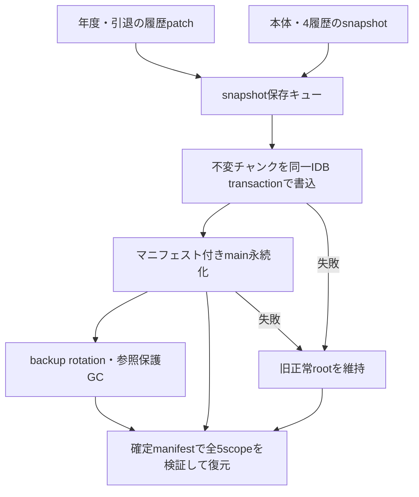

# F3-B 設計確定案と互換性境界

調査基準: main 9efaf56, F3-A version 5 manifest設計。F3-Bをversion 6として実装。F3-Aだけで通算成績整合性を保証しない。

## 原因と影響
- useOffseason.handleNextYear: career_logsを書いた後に日程生成と新年度handleSave。後段失敗で履歴だけ確定する。
- 引退も同様に先行書込。
- 新規handleSelect: nextSaveIdは作るが履歴初期化へ渡さずplayerId既存値を置換。新規本体確定前に旧履歴を失う。
- CareerTableと旧ロード移行はplayerId固定キー。ゲーム別・保存世代別の帰属がない。
- 通常career batchは単一transactionであり、IDB自体の部分失敗は通常rollbackされる。年度本体との確定境界が別なのが主因。

## 採用方式
通算履歴全体の不変チャンクをsaveIdと世代で識別し、本体マニフェストへ参照を追加する。初期履歴、年度更新、引退を「保存要求に付随する確定待ち履歴」として渡す。本体setItemが成功した世代だけをCareerTableが参照する。

通常試合では通算チャンク参照を再利用。年度末・引退・初期化でのみ変更する。全選手の通算履歴を毎試合本体へ含めない。全履歴チャンクの容量を実測し、世代保持が重い場合のみ選手別チャンク＋indexへ分割する。

次点のstaging→本体確定→履歴昇格は、昇格前終了時の復旧journalと旧バックアップ履歴保護が別途必要で、確定境界が増えるため不採用。playerIdにsaveIdを付けるだけ／本体保存後へ書込順序を変えるだけではB01とバックアップ同年復旧を満たさない。

## 実装単位
1. 読取専用career移行: 現在ゲームの旧固定キーと選手inline/recent履歴からsnapshotを構築。読み込みだけで旧固定キーを書き換えない。
2. 新規ゲーム: 初期履歴を次のsaveIdのメモリsnapshotへ保持し、既存ゲームの履歴を触らず最初の本体保存に同梱。
3. 年度更新／引退: 履歴patchを生成し、次年度本体payloadと同じsave要求へ渡す。失敗時は旧参照を維持し、再試行patchを失わない。
4. career read API: saveId＋確定マニフェストを指定。CareerTable／PlayerModal／Alumni／契約更改の呼出元へ現在の保存IDを通す。
5. GC: primary/bk1/bk2のcareer参照をF3-Aチャンクと同時保護。旧バックアップがある間は旧career固定キーを保存する。

## 重大な旧データ制約
既存career_logsには保存IDがなく、過去のゲーム切替で既に同じplayerIdが上書きされた可能性がある。現在ゲームへの移行は「現在選手に対応する既存履歴を採用」という限定的な帰属推定であり、既に混在した旧データの正しいゲームを完全に復元することはできない。旧バックアップも同様。

対案は旧IDB履歴を無条件採用せず、本体内の直近3年だけを引き継いでそれ以前を未記録と明示する方式。誤帰属は避けられるが既存の長期履歴を捨てる。既存データの保全を優先し、旧固定キーを削除せず、移行起源を記録する方針が最有力。この制約と対案を実装前に提示済み。旧固定キーは読取専用とし、帰属推定の起源をマニフェスト参照先データに記録する。

## 受入テスト
B01新年度本体保存失敗→旧年度再開時に未来履歴なし。
B02通算書込transaction abort→新年度本体も未確定、旧履歴保護。
B03異なるsaveIdで同一playerId→両方の履歴が分離。
B04複数年度の更新・保存・再開→重複・欠落なし。
追加: 引退後保存失敗、同年移籍履歴更新後の旧backup復旧、新規初期化後の初回本体失敗、旧移行失敗、career参照欠損。
全テストは実save/load/career APIを動かし、storage境界だけにエラーを注入する。

## 打球アーカイブ境界
saveId分離とbatch/aggregate/metaの単一transactionは既存仕様として維持。メイン本体とは独立確定であり、過去本体復旧後に未来試合打球が残る可能性がある。再試行待ちのメモリレコードはページ終了で失われる。F3-Bの通算履歴PRと一括で原子性対応しない場合、ここは未解決として記録し、未記録を0扱いしない。

## 保存・復旧データフロー

## 実装結果と回帰証拠

version 6は既存4scope＋careerLogsを同じsave_chunks transactionで書き、mainの永続化成功を確定境界とする。version 5の参照はversion 5 rowのまま検証・再利用できる。version 4／versionなしinline／saveIdなしの旧データも正規化した同一rootから読み取り、固定career_logsを変更せず移行する。数値playerId 0の旧行も読み取る。旧固定行の削除は所有ゲームを証明できないため行わない。

通常保存はcareer参照を実データ検証して再利用する。年度更新patchは次年度payloadと同じ要求へ添付。引退patchはuseGameStateの確定待ちメモリへ保持し、本体失敗時は残し、成功時だけ対象patchを除去する。ロード・ゲーム切替時は破棄する。新規ゲームは全初期履歴と初回mainを先に確定し、成功後に画面・球団stateを公開する。

前提を満たさない旧年度要求はストレージ書込前にstale_saveで拒否し、別タブ競合と通知を分ける。失敗した未来年度から旧年度へ戻る要求には未来patchを継承しない。同年度の履歴はyear/teamの既存entry keyで更新し、重複を作らない。

RED→GREEN: B01–B04、IDB abort、本体失敗、ゲーム切替、backup、欠損career参照、失敗queue patch継承、旧inline全履歴、version 5実fixture、versionなし、saveIdなし、数値ID 0、成功年度更新後の古い要求拒否。save/loadは実コード、障害はStorage/IDBの境界に注入。年次と引退は実hook＋実保存処理でも検証。

独立レビューのImportant 2件（saveIdなし正規化rootの不一致、成功新年度後の旧年度上書き）はそれぞれ実再現→回帰追加→修正。再レビューでImportant/Critical残件なし。通知の小指摘もRED→GREENで対応。

既存テストの境界変更: initialize/append先行書込を期待していたmockは、初回commit／年度handleSaveの履歴payloadへ移した。既存の選手数661・全初期履歴2009件／376選手・日程858対戦／各球団143試合などの期待は維持。A14のGC期待は、再利用するcareer rowを削除対象から除き、変更した4scopeの旧row削除は維持。削除・skip追加なし。

## 検証の途中記録

初回関連unitは旧先行書込mockに依存する8件が失敗。新しい確定境界へ期待の観測箇所だけを移し、関連33件成功。その後全unit 704成功・既存skip 2件。追加通知testの最終全unitは後述。

初回対象E2Eは6件中4成功・2失敗。両ブラウザのbackup testがローテーション間隔内でも直前世代がbackupとなると仮定していた。実rawで旧世代復元を確認し、間隔markerを明示するfixtureへ変更。実annual UIの本体失敗→再試行→3年反復はChromium／Mobile WebKitとも成功。失敗を再実行で消さず原因と修正を保持する。

最初の性能試行は全careerLogを欠くcompact fixtureで不公平となるため停止（未完走、採用しない）。最終比較は実createInitialTeamsの全2009履歴をseed 20261009で一度生成し、同じfixtureでF3-A/F3-Bを各10回測定。初回baselineは旧career初期化＋mainの合計、currentは統合commit。5年相当は全選手に合成5年度を足した容量stressで、実プレイ5年ではない。

## 容量改善

非圧縮通算全体チャンクの実測で、Chromiumのorigin usage推定が初回約2.0MB、5年相当3career世代約11.9MBとなった。JSON論理サイズだけではnativeストレージ増加を見落とすため、8192文字以上の通算JSONはnative CompressionStream／DecompressionStreamが揃う環境ではgzip-base64、それ以外は既存LZStringのlz-utf16で圧縮する方式へ変更。小さい履歴はplain形式を保持し、plain version 6も読める。wireデータのチェックサム照合後に解凍・構造検証する。参照を再利用する際も実row検証を省略しない。

100年分の同一履歴で保存rowの容量budgetとexact readbackをRED→GREENで検証。最初の圧縮試行では空履歴も圧縮したため、既存GC testの「本体rootを再展開しない」spyにcareer解凍まで捕捉された。小履歴は圧縮しない閾値を設け、既存期待を変更せず維持した。圧縮適用は最終source固定の性能runで評価する。通常再利用やbackup rotationでもcareerを解凍・検証するコストは省略しない。圧縮追加を再レビューしImportant/Criticalなし。非圧縮比較は容量調査用、一部未完走を最終合格として扱わない。

追加対象E2Eは6件中4成功・2失敗（画面確認testのReact DOM default exportをnamed exportと誤読）。両ブラウザの保存障害／3年UI反復は成功。テスト側の実module importを修正し、全受入runへ進む。skipや期待値変更は行わない。

## 最終ゲート・性能

npm ci成功。最終sourceのnpm testは710成功・既存skip 2件（追加skipなし）、npm run build成功（既存の500kB chunk警告）。smokeは21/21成功（7.0分）。full E2Eは65/65成功（13.5分）、Chromium／Mobile WebKit、1 worker・retry 0。validate:physics-hrは1/1成功（4.54秒）。全unitにも物理演算・保存連携チェックを含む。性能source 3ファイルのSHA256一致確認とgit diff --check成功。CIはPR作成後のremote headで別途確認し、PR本文へ記録する。F3-A #429依存の別PRで、baseはmain。Aを先に判断し、BはAマージ後の差分・CI確認までマージしない。

## UI確認の範囲

追加通知は既存CareerTableとflow-mutedを再利用し、全画面CSS・表・グラフを変更しない。saveIdはPlayerModal、Alumni、契約更改、編成計画の実呼出元から渡す。実APIで全初期履歴を保存した後、同じCareerTableを正常読込とIDB読込失敗の状態で描画し、両ブラウザで390×844、360×844、1440×900の折返し・表示幅を検証した。通知は色だけに依存せずrole=statusと説明文を持つ。

この幅確認は実CareerTableの独立mountで、球団画面／モーダル全体の前後比較ではない。既存の画面・進行E2Eは別途全suiteで検証する。画像は通常状態→読込障害状態の比較であり、旧コード画像と称しない。CSS境界は変更していないため760/761等のレイアウト境界再検証は不適用。

| Chromium | 正常読込 | 読込障害 |
|---|---|---|
| 390px | [通常](f3-b-ui/chromium-career-normal-390.png) | [通知](f3-b-ui/chromium-career-error-390.png) |
| 360px | [通常](f3-b-ui/chromium-career-normal-360.png) | [通知](f3-b-ui/chromium-career-error-360.png) |
| desktop | [通常](f3-b-ui/chromium-career-normal-1440.png) | [通知](f3-b-ui/chromium-career-error-1440.png) |

Mobile WebKit 360px: [通常](f3-b-ui/mobile-webkit-career-normal-360.png) / [通知](f3-b-ui/mobile-webkit-career-error-360.png)。他のWebKit幅画像も対象testのCI artifactに出力する。

## 最終性能・容量比較（F3-A→F3-B）

Chromium、同一fixture、各10回。全初期通算2009件。5年相当は全選手へ合成5年度を追加するstressで、実プレイ5年ではない。タイマーは実save/loadを囲み、baseline初回は旧career初期化も含む。保存間隔markerを明示し、通常ケースもbackup検証・rotationを含む。raw samples／source hashは[f3-b-performance.json](f3-b-performance.json)。

| ケース | 保存 前 中央/最遅ms | 保存 後 中央/最遅ms | 読込 前 中央/最遅ms | 読込 後 中央/最遅ms |
|---|---:|---:|---:|---:|
| 初回（全通算初期化を含む） | 401.6 / 441.5 | 408.1 / 528.0 | 50.5 / 54.6 | 73.7 / 83.3 |
| 通常試合後 | 338.3 / 484.3 | 359.9 / 433.3 | 49.3 / 60.4 | 69.9 / 83.5 |
| 5試合後 | 320.8 / 375.0 | 356.3 / 467.4 | 48.7 / 55.7 | 69.1 / 78.5 |
| オフシーズン | 341.4 / 423.3 | 357.6 / 378.9 | 48.5 / 70.6 | 72.0 / 82.7 |
| 5年相当・通算更新／3世代 | 467.0 / 494.8 | 563.0 / 629.7 | 56.8 / 65.8 | 95.6 / 132.5 |
| 5年相当・部分保存／通算再利用 | 466.3 / 489.5 | 543.9 / 600.4 | 58.6 / 67.5 | 95.6 / 128.1 |
| backup復旧 | 312.4 / 364.1 | 349.8 / 444.3 | 52.0 / 58.5 | 71.4 / 89.9 |

| 容量 | 初回 前→後 | 5年相当3世代 前→後 | 5年部分保存 前→後 |
|---|---:|---:|---:|
| IDB論理保存量B | 1,298,706 → 124,481 | 4,848,157 → 858,501 | 4,845,222 → 505,890 |
| main＋backup UTF-16 B | 323,628 → 323,762 | 1,069,854 → 1,070,160 | 1,069,904 → 1,070,316 |
| origin usage推定B | 338,573 → 135,183 | 925,023 → 547,533 | 934,751 → 225,808 |

通算全体の圧縮で容量増を解消。通常試合の保存中央値+22ms、5試合+35ms、初回+7ms。長期部分保存+78ms、長期通算更新+96ms。初回最遅442→528ms。全通算の解凍・参照検証が必要なため、読込中央値は通常+20〜24ms、長期+37〜39ms。旧方式は履歴が本体と原子的ではなく、この差は保護を増やすコストを含む。検証を省略して速度を戻さない。

使用量推定はnativeブラウザが返すorigin estimateで非同期集計・内部格納の影響があり、端末の物理使用量や将来上限を保証しない。論理保存量はJSON UTF-8と圧縮local UTF-16を別計上する。大きい通算rowのdecodeを通常保存でも実施するため、さらに長い育成・選手数では増加し得る。選手別分割や検証済みwireキャッシュは将来の改善余地だが、今回の最小変更には含めない。

## 最終通知補完

実hookのStorage障害注入で、初回quota、年度更新の永続エラー文面、初回main成功後metadata failureの3件をREDで再現。年度更新は実useGameStateの失敗toastには既に容量不足表示があり、今回の追加は画面に残る文面を補完するもの。初回はsave resultを保持してquota専用説明を表示し、core成功＋warningは既存saveFeedbackへ渡す。年度更新失敗は年度未進行の説明を維持して容量不足を追記する。旧IDB初期化失敗の文言・リトライ導線は維持。

通知差分の前の最終smoke試行は6件成功時点で停止（未完走、合格扱いしない）。修正後sourceの全unit/build/smoke/full E2Eは上記の通り完走・成功。保存engine 3ファイルは性能測定時と同一SHA256であり、通知差分を理由に性能値を置き換えない。

圧縮互換性: native streamを持たない環境のlz-utf16書込・再読込・部分保存も回帰検証。gzip-base64 rowはDecompressionStream対応環境で読む。対応APIが消失した環境では不完全な履歴を採用せず候補を無効扱いする。新形式のブラウザ間ファイル移送機能は本PRの対象外。
